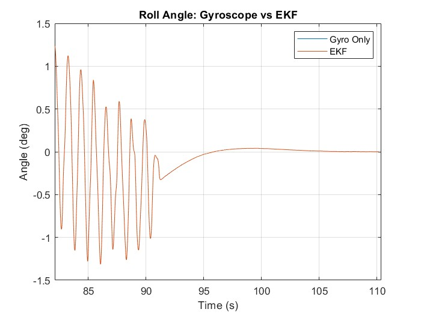
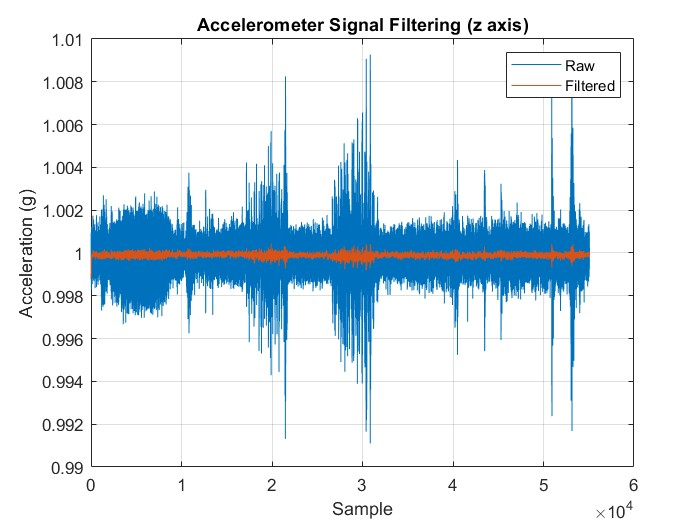
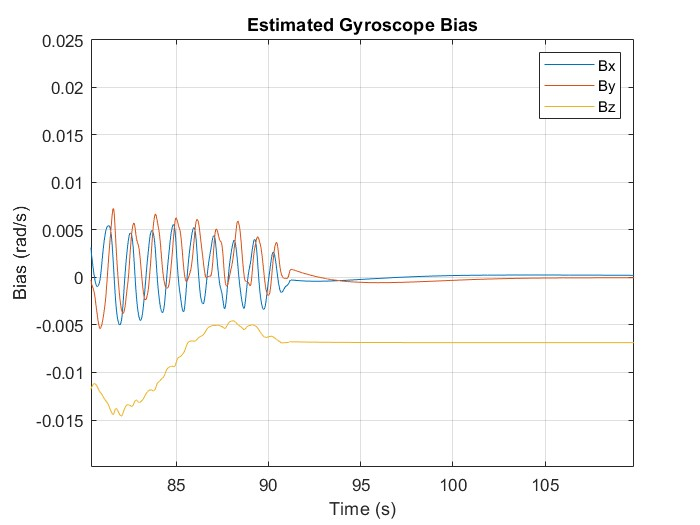
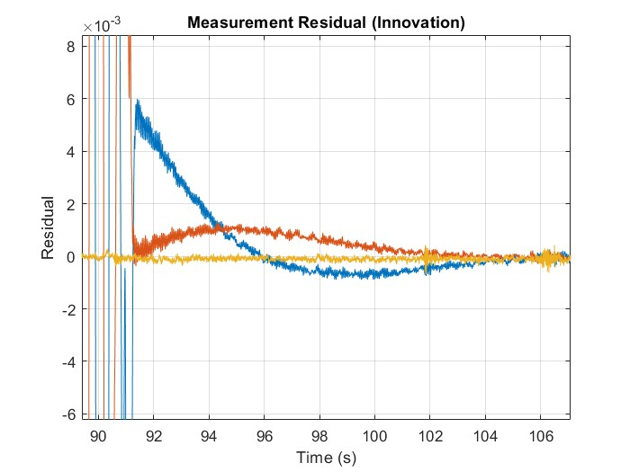

## Project Description

This project focuses on inclination estimation using an IMU consisting of two 3-axis gyroscopes and one accelerometer.

In dynamic conditions, each sensor has inherent limitations:
- Accelerometers are sensitive to external accelerations, leading to noisy measurements and sudden spikes
- Gyroscopes provide smooth short-term estimates but suffer from drift over time

To overcome these issues, a sensor fusion approach based on the Extended Kalman Filter (EKF) is implemented.

---

## EKF Framework

The EKF is a recursive state estimation algorithm designed for nonlinear systems. It estimates the system state by combining:
- A prediction model (system dynamics)
- A correction step (sensor measurements)

The filter operates in two main steps:

### Prediction Step

$$
\hat{\mathbf{x}}_k = f(\mathbf{x}_{k-1}, \mathbf{u}_k)
$$

$$
\hat{\mathbf{P}}_k = \mathbf{F}_k \mathbf{P}_{k-1} \mathbf{F}_k^T + \mathbf{Q}_k
$$

### Correction Step

$$
\mathbf{v}_k = \mathbf{z}_k - h(\mathbf{x}_k)
$$

$$
\mathbf{K}_k = \mathbf{P}_k \mathbf{H}_k^T (\mathbf{H}_k \mathbf{P}_k \mathbf{H}_k^T + \mathbf{R}_k)^{-1}
$$

$$
\mathbf{x}_k = \hat{\mathbf{x}}_k + \mathbf{K}_k \mathbf{v}_k
$$

$$
\mathbf{P}_k = (\mathbf{I} - \mathbf{K}_k \mathbf{H}_k)\hat{\mathbf{P}}_k
$$

The Kalman gain $\mathbf{K}$ determines how much the filter trusts the measurements versus the model.

---

## Sensor Fusion Strategy

- Gyroscope → short-term accurate, but drifting  
- Accelerometer → noisy, but provides long-term reference (gravity)  

The EKF combines both to achieve a more stable and physically consistent estimation.

---

## Noise Modeling

The EKF explicitly accounts for uncertainty in both:
- System dynamics (process noise $\mathbf{Q}$)
- Sensor measurements (measurement noise $\mathbf{R}$)

These matrices were estimated using sensor data collected under static conditions.

---

## Measurement Model

$$
\mathbf{z} = \mathbf{R}(\mathbf{q})^T \mathbf{g}
$$

This assumes the accelerometer measures only gravity, which is valid under low dynamic motion.

---

## Results

### EKF vs Gyroscope (Roll Comparison)

The EKF output shows similar performance to gyro-only estimation under the tested conditions.  
This is mainly due to limited dynamic excitation and non-optimized noise parameters.

---

### Accelerometer Filtering

The filtered accelerometer signal reduces high-frequency noise, improving measurement stability.

---

### Bias Estimation

The EKF estimates gyroscope bias as part of the state vector, enabling drift compensation.

---

### Measurement Residual

The residual represents the difference between predicted and measured values, indicating filter consistency.

---

## Limitations

- Accelerometer is assumed to measure only gravity  
- Performance degrades under strong external acceleration  
- Requires proper tuning of $Q$ and $R$ matrices  

---

## Implementation Notes

Due to limited datasets, extensive parameter tuning was not performed.

EKF performance strongly depends on:
- Noise covariance tuning  
- Motion characteristics  
- Application type (e.g., automotive vs railway)

---

## Conclusion

This project demonstrates a complete EKF-based sensor fusion pipeline, including:

- Nonlinear system modeling  
- Quaternion-based state estimation  
- Sensor fusion (gyro + accelerometer)  
- Bias estimation  

While further tuning is required, the implementation provides a solid foundation for real-world applications.

---

## Future Work

- Parameter tuning for different motion profiles  
- Handling dynamic acceleration more robustly  
- Real-time implementation  
